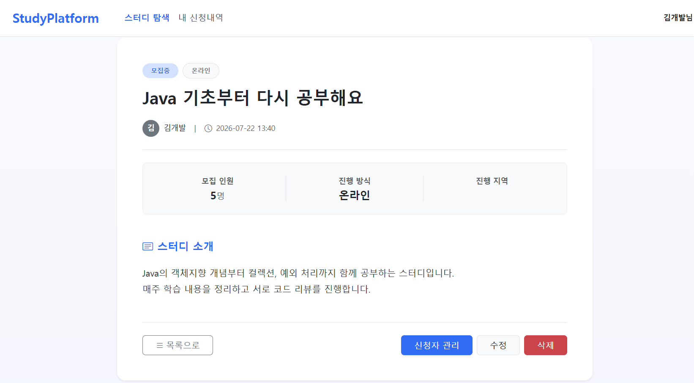
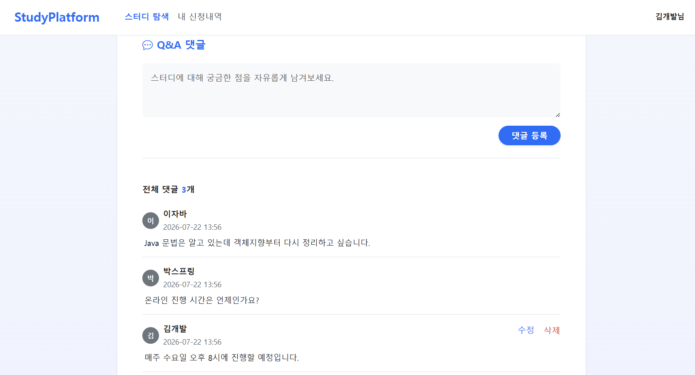
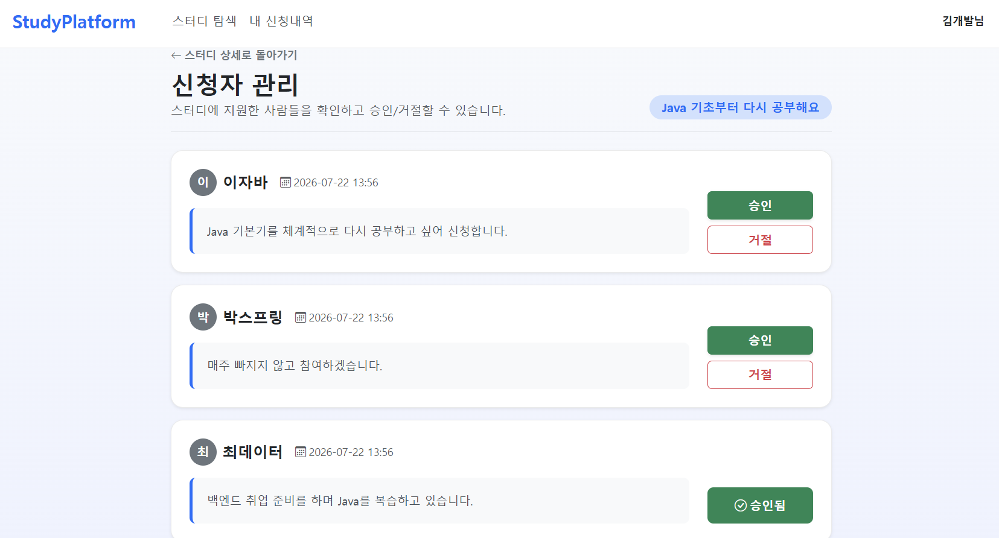
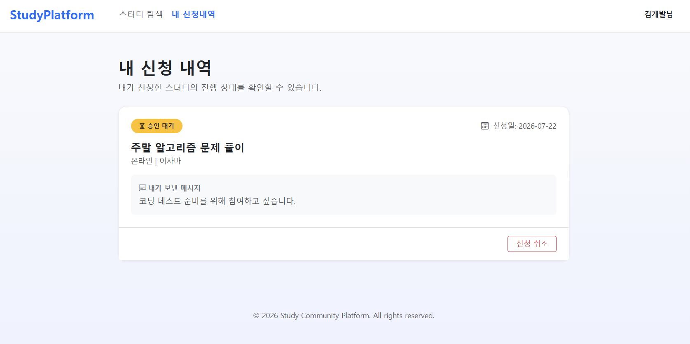

# 📚 Study Community Platform

## 💡 프로젝트 소개

Spring MVC, Spring Data JPA, Thymeleaf를 기반으로 구현한 스터디 커뮤니티 웹 애플리케이션입니다.

회원이 스터디를 개설하고 다른 회원이 참가를 신청할 수 있으며, 스터디 방장이 신청을 승인하거나 거절할 수 있습니다.

단순 CRUD 구현을 넘어 회원, 스터디, 참가 신청 사이의 **권한 검증과 상태 변화에 필요한 비즈니스 로직을 설계하는 것**에 집중했습니다.

---

## 🖥 주요 화면

### 스터디 목록

등록된 스터디의 모집 방식, 지역, 모집 상태 등을 확인할 수 있습니다.


### 스터디 상세

스터디의 상세 정보와 모집 상태를 확인하고 참가 신청을 할 수 있습니다.



### 댓글 작성 및 관리

로그인 사용자는 스터디에 관한 질문이나 의견을 댓글로 작성할 수 있습니다.  
댓글 작성자는 자신이 작성한 댓글을 수정하거나 삭제할 수 있습니다.



### 참가 신청 관리

스터디 방장은 참가 신청 목록을 확인하고 신청을 승인하거나 거절할 수 있습니다.



### 내 신청 내역

로그인 사용자는 자신이 신청한 스터디와 현재 신청 상태를 확인할 수 있습니다.  
승인 대기 중인 신청은 직접 취소할 수 있습니다.




---

## 🛠 기술 스택

* **Language:** Java 21
* **Framework:** Spring Boot 4.x, Spring MVC
* **Data:** Spring Data JPA, H2
* **Template Engine:** Thymeleaf
* **Build Tool:** Gradle
* **Test:** JUnit 5, AssertJ

---

## 🚀 주요 기능

### 회원

* 회원가입 및 로그인
* 회원 정보 조회 및 수정
* 회원 탈퇴
* 이메일과 닉네임 중복 검증
* 탈퇴 회원 데이터 보존을 위한 논리적 삭제 적용

### 스터디

* 스터디 등록, 조회, 수정 및 삭제
* 스터디 방장 권한 검증
* 모집 방식, 지역 및 모집 정원 설정
* 모집 정원 충족 시 모집 상태를 `CLOSED`로 변경
* 연관 데이터 보존을 위한 논리적 삭제 적용

### 참가 신청

* 스터디 참가 신청
* 신청 취소 후 재신청
* 스터디 방장의 신청 승인 및 거절
* 신청 상태에 따른 중복 신청 검증
* 승인된 인원을 기준으로 정원 초과 여부 확인

### 댓글

* 스터디 댓글 등록, 조회, 수정 및 삭제
* 작성자 본인만 댓글을 수정하거나 삭제할 수 있도록 권한 검증
* 삭제된 댓글의 이력을 보존하기 위한 논리적 삭제 적용

---

## 🔐 권한 및 예외 처리

클라이언트 화면에서 버튼을 숨기는 것만으로 권한을 제어하지 않고, 서버에서 로그인 사용자와 리소스 소유자를 비교하도록 구현했습니다.

* 비로그인 사용자의 보호된 URL 접근 차단
* 스터디 수정 및 삭제 시 방장 권한 확인
* 신청 승인 및 거절 시 스터디 방장 권한 확인
* 댓글 수정 및 삭제 시 작성자 권한 확인
* 세션에 저장된 로그인 회원을 공통으로 처리하기 위한 `HandlerMethodArgumentResolver` 적용

---

## 🧩 주요 도메인 상태

### 스터디 상태

* `OPEN`: 모집 중
* `CLOSED`: 모집 마감

### 참가 신청 상태

* `PENDING`: 승인 대기
* `APPROVED`: 승인
* `REJECTED`: 거절
* `CANCELED`: 신청 취소

신청 상태를 문자열이나 Controller 로직에서 직접 변경하지 않고, 엔티티의 상태 변경 메서드를 통해 관리하도록 구성했습니다.

---

## 🔥 트러블슈팅 및 기술적 의사결정

기능 구현 과정에서 발생한 문제의 원인과 해결 과정을 별도의 문서로 정리했습니다.

| 이슈 및 고민                                                                           | 해결 과정 및 배운 점                                                                             |
| :-------------------------------------------------------------------------------- | :--------------------------------------------------------------------------------------- |
| **[비로그인 사용자 NPE 방어](./docs/troubleshooting/npe-guest-access.md)**                 | 세션 데이터가 항상 존재한다고 가정해 발생하던 예외를 분석하고, 비로그인 상태를 명시적으로 검사하도록 개선했습니다.                         |
| **[서버 측 권한 검증 적용](./docs/troubleshooting/prevent-api-authorization-bypass.md)**   | 화면의 버튼 노출 여부에만 의존하지 않고, Controller와 Service에서 로그인 사용자와 리소스 소유자를 비교하도록 권한 검증을 적용했습니다.     |
| **[스터디 신청 취소 후 재신청 처리](./docs/troubleshooting/reapply-after-cancel-bug.md)**      | 모든 신청 이력을 중복으로 판단하지 않고, `PENDING`과 `APPROVED` 상태의 유효한 신청만 중복으로 판단하도록 신청 정책을 개선했습니다.      |
| **[회원 수정 시 본인 데이터 중복 검증 오류](./docs/troubleshooting/self-data-validation-bug.md)** | 회원가입과 회원 수정의 검증 조건을 분리하고, 수정 대상 회원 본인의 이메일과 닉네임은 중복 대상에서 제외하도록 개선했습니다.                   |
| **[TestDataInit 초기화 시점 문제](./docs/troubleshooting/test-data-init-failed.md)**     | `@PostConstruct`와 Spring AOP 프록시의 동작 시점을 분석하고, 애플리케이션 컨텍스트 초기화 이후 테스트 데이터를 저장하도록 변경했습니다. |
| **[Member createdAt null 예외](./docs/troubleshooting/member-created-at-null.md)**  | JPA 라이프사이클 콜백인 `@PrePersist`와 `@PreUpdate`를 적용하여 엔티티 생성 및 수정 시간을 자동으로 관리하도록 개선했습니다.      |

---

## 📂 프로젝트 구조

```text
src
├── main
│   ├── java
│   │   └── com.study.study_community_platform
│   │       ├── controller
│   │       ├── domain
│   │       ├── repository
│   │       ├── service
│   │       └── config
│   └── resources
│       ├── templates
│       ├── static
│       └── application.yml
└── test
    └── java
        └── com.study.study_community_platform
            └── service
```

---

## 📂 ERD

* [요구사항 명세 및 논리·물리 모델링 문서](./docs/04-physical-model.md)


---

## ▶️ 실행 방법

### 요구 환경

* Java 21

### 프로젝트 실행

macOS 또는 Linux:

```bash
./gradlew bootRun
```

Windows:

```powershell
./gradlew.bat bootRun
```

실행 후 다음 주소로 접속합니다.

```text
http://localhost:8080
```

현재 데이터베이스 설정에 따라 애플리케이션 실행 전 H2 데이터베이스 실행이 필요할 수 있습니다.

---

## 🧪 테스트 실행

macOS 또는 Linux:

```bash
./gradlew clean test
```

Windows:

```powershell
./gradlew.bat clean test
```

서비스 계층을 중심으로 회원, 스터디, 참가 신청 및 댓글의 주요 비즈니스 규칙을 검증합니다.

---

## 📌 개선 예정 사항

* Spring Security와 BCrypt 기반 인증 구조 적용
* Controller에 분산된 권한 검증을 Service 계층으로 이동
* 신청 승인 상태 전이 규칙 강화
* 동시 승인 요청에 대한 정원 초과 방지
* 멀티스레드 기반 동시성 테스트 추가
* 도메인 예외와 전역 예외 처리 적용
* 목록 조회 페이지네이션 적용
* GitHub Actions를 이용한 테스트 자동화
* Docker 및 클라우드 배포 환경 구성
