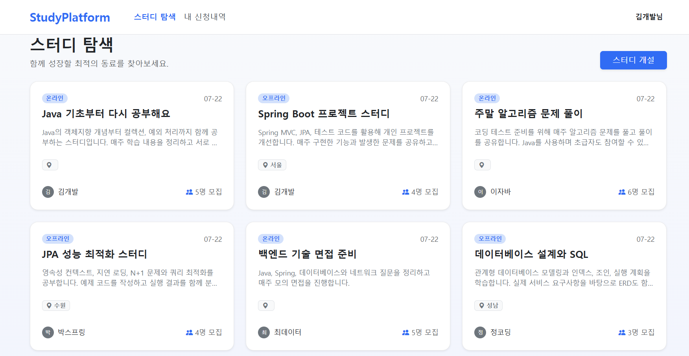

# 📚 Study Community Platform

## 💡 프로젝트 소개

Spring MVC, Spring Data JPA, Thymeleaf를 기반으로 구현한 스터디 커뮤니티 웹 애플리케이션입니다.

회원은 스터디를 개설하거나 다른 회원의 스터디에 참가를 신청할 수 있습니다. 스터디 방장은 신청을 승인하거나 거절하고, 모집 정원과 모집 상태를 관리할 수 있습니다.

단순 CRUD 구현을 넘어 회원, 스터디, 참가 신청 사이의 권한 검증과 상태 변화에 필요한 비즈니스 규칙을 코드로 표현하는 데 집중했습니다.

- **개발 기간:** 2026.02.13 ~ 2026.07.14
- **개발 인원:** 1명
- **개발 형태:** 개인 프로젝트

<br>

## 🖥 주요 화면

### 스터디 목록

등록된 스터디의 진행 방식, 지역, 모집 상태와 모집 정원을 확인할 수 있습니다.



<br>

### 스터디 상세

스터디의 상세 정보와 모집 상태를 확인하고 참가를 신청할 수 있습니다.


<br>

### 댓글 작성 및 관리

로그인한 회원은 스터디에 관한 질문이나 의견을 댓글로 작성할 수 있습니다.

댓글 작성자는 본인이 작성한 댓글만 수정하거나 삭제할 수 있습니다.


<br>

### 참가 신청 관리

스터디 방장은 참가 신청 목록을 확인하고 신청을 승인하거나 거절할 수 있습니다.


<br>

### 내 신청 내역

로그인한 회원은 자신이 신청한 스터디와 현재 신청 상태를 확인할 수 있습니다.

승인 대기 상태인 신청은 직접 취소할 수 있습니다.


<br>

## 🛠 기술 스택

| 구분 | 기술 |
| --- | --- |
| Language | Java 21 |
| Framework | Spring Boot 4.0.3, Spring MVC |
| Data Access | Spring Data JPA, Hibernate |
| Database | H2 |
| View | Thymeleaf |
| Security | Spring Security Crypto, PasswordEncoder |
| Test | JUnit 5, AssertJ |
| Build | Gradle |
| Version Control | Git, GitHub |

<br>

## 🚀 주요 기능

### 회원

- 회원가입 및 로그인
- 로그인 ID, 이메일, 닉네임 중복 검증
- 회원정보 조회 및 수정
- 회원 탈퇴
- `PasswordEncoder`를 이용한 비밀번호 단방향 해시 저장
- 탈퇴 회원 데이터 보존을 위한 논리적 삭제

### 스터디

- 스터디 등록, 조회, 수정 및 삭제
- 스터디 방장 권한 검증
- 온라인·오프라인 진행 방식 설정
- 지역 및 모집 정원 설정
- 승인 인원이 모집 정원에 도달하면 모집 상태를 `CLOSED`로 변경
- 연관 데이터 보존을 위한 논리적 삭제

### 참가 신청

- 스터디 참가 신청
- 신청 취소 및 재신청
- 스터디 방장의 신청 승인·거절
- 신청 상태를 기준으로 한 중복 신청 검증
- 승인된 인원을 기준으로 모집 정원 초과 여부 검증

### 댓글

- 스터디 댓글 등록, 조회, 수정 및 삭제
- 작성자 본인만 댓글을 수정하거나 삭제할 수 있도록 권한 검증
- 삭제된 댓글 이력 보존을 위한 논리적 삭제

<br>

## 🔐 인증·권한 및 예외 처리

클라이언트 화면에서 버튼을 숨기는 것만으로 권한을 제어하지 않고, 서버에서 로그인 회원과 리소스 소유자를 비교하도록 구현했습니다.

- 비로그인 회원의 보호된 URL 접근 차단
- 스터디 수정 및 삭제 시 방장 권한 검증
- 참가 신청 승인 및 거절 시 스터디 방장 권한 검증
- 댓글 수정 및 삭제 시 작성자 권한 검증
- `Interceptor`를 이용한 로그인 여부 확인
- `HandlerMethodArgumentResolver`를 이용한 로그인 회원 공통 처리
- 회원가입 시 비밀번호를 단방향 해시로 변환하여 저장
- 로그인 시 입력한 비밀번호와 저장된 해시값을 `matches()`로 비교

<br>

## 🧩 주요 도메인 상태

### 스터디 상태

| 상태 | 설명 |
| --- | --- |
| `OPEN` | 모집 중 |
| `CLOSED` | 모집 마감 |

### 참가 신청 상태

| 상태 | 설명 |
| --- | --- |
| `PENDING` | 승인 대기 |
| `APPROVED` | 승인 |
| `REJECTED` | 거절 |
| `CANCELED` | 신청 취소 |

신청 상태를 Controller에서 문자열로 직접 변경하지 않고, 엔티티의 상태 변경 메서드를 통해 관리하도록 구성했습니다.

<br>

## 🔥 트러블슈팅 및 기술적 의사결정

기능 구현 과정에서 발생한 문제의 원인과 해결 과정을 별도의 문서로 정리했습니다.

| 이슈 및 고민                                                                           | 해결 과정 및 배운 점 |
|-----------------------------------------------------------------------------------| --- |
| **[비밀번호 평문 저장 문제](./docs/troubleshooting/password-encoding.md)**                   | `PasswordEncoder`를 적용해 회원가입 시 비밀번호를 단방향 해시로 저장하고, 로그인 시 입력값과 저장된 해시값을 비교하도록 변경했습니다. |
| **[비로그인 사용자 NPE 방어](./docs/troubleshooting/npe-guest-access.md)**                 | 세션 데이터가 항상 존재한다고 가정해 발생하던 예외를 분석하고, 비로그인 상태를 명시적으로 검사하도록 개선했습니다. |
| **[서버 측 권한 검증 적용](./docs/troubleshooting/prevent-api-authorization-bypass.md)**   | 화면의 버튼 노출 여부에만 의존하지 않고, 서버에서 로그인 회원과 리소스 소유자를 비교하도록 권한 검증을 적용했습니다. |
| **[스터디 신청 취소 후 재신청 처리](./docs/troubleshooting/reapply-after-cancel-bug.md)**      | 모든 신청 이력을 중복으로 판단하지 않고, `PENDING`과 `APPROVED` 상태의 유효한 신청만 중복으로 판단하도록 신청 정책을 개선했습니다. |
| **[회원 수정 시 본인 데이터 중복 검증 오류](./docs/troubleshooting/self-data-validation-bug.md)** | 회원가입과 회원 수정의 검증 조건을 분리하고, 수정 대상 회원 본인의 기존 정보는 중복 대상에서 제외하도록 개선했습니다. |
| **[TestDataInit 초기화 시점 문제](./docs/troubleshooting/test-data-init-failed.md)**     | `@PostConstruct`와 Spring AOP 프록시의 적용 시점을 확인하고, 애플리케이션 컨텍스트 초기화 이후 테스트 데이터를 저장하도록 변경했습니다. |
| **[Member createdAt null 예외](./docs/troubleshooting/member-created-at-null.md)**  | JPA 라이프사이클 콜백인 `@PrePersist`, `@PreUpdate`를 적용해 엔티티 생성일과 수정일을 자동으로 관리하도록 개선했습니다. |

<br>

## 📂 프로젝트 구조

```text
src
├── main
│   ├── java
│   │   └── com.study.study_community_platform
│   │       ├── config
│   │       ├── controller
│   │       ├── domain
│   │       ├── repository
│   │       └── service
│   └── resources
│       ├── static
│       ├── templates
│       └── application.yml
└── test
    └── java
        └── com.study.study_community_platform
            └── service
```

<br>

## 📊 ERD

회원, 스터디, 참가 신청과 댓글 사이의 관계를 기준으로 도메인을 구성했습니다.


<br>

## ▶️ 실행 방법

### 요구 환경

- Java 21
- H2 Database

### 저장소 복제

```bash
git clone https://github.com/ldhan0115/study-community-platform.git
cd study-community-platform
```

### H2 실행

현재 기본 설정은 H2 TCP 모드를 사용합니다.

```yaml
jdbc:h2:tcp://localhost/~/study-platform
```

애플리케이션을 실행하기 전에 H2 TCP Server를 실행해야 합니다.

### macOS 또는 Linux

```bash
./gradlew bootRun
```

### Windows

```powershell
.\gradlew.bat bootRun
```

실행 후 다음 주소로 접속합니다.

```text
http://localhost:8080
```

<br>

## 🧪 테스트 실행

### macOS 또는 Linux

```bash
./gradlew clean test
```

### Windows

```powershell
.\gradlew.bat clean test
```

서비스 계층을 중심으로 다음 비즈니스 규칙을 테스트합니다.

- 회원가입과 중복 회원 검증
- 비밀번호 해시 저장 및 로그인 검증
- 스터디 등록과 권한 검증
- 참가 신청, 승인·거절과 정원 검증
- 신청 취소 후 재신청
- 댓글 등록·수정·삭제 권한 검증

<br>

## 📌 개선 예정 사항

- Spring Security 기반 인증·인가 구조로 전환
- Controller에 분산된 권한 검증을 Service 계층으로 이동
- 참가 신청 상태 전이 규칙 강화
- 동시 승인 요청에 대한 모집 정원 초과 방지
- 멀티스레드 기반 동시성 테스트 추가
- 도메인 예외와 전역 예외 처리 적용
- 목록 조회 페이지네이션 적용
- MySQL 전환 및 실행 환경별 데이터베이스 설정 분리
- GitHub Actions를 이용한 테스트 자동화
- Docker와 클라우드 배포 환경 구성