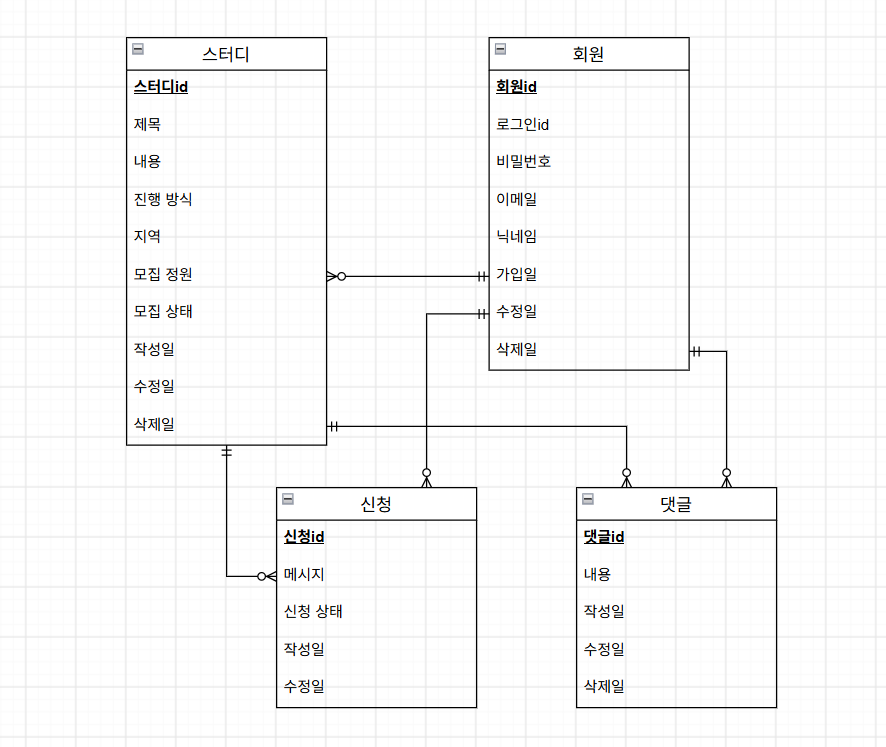
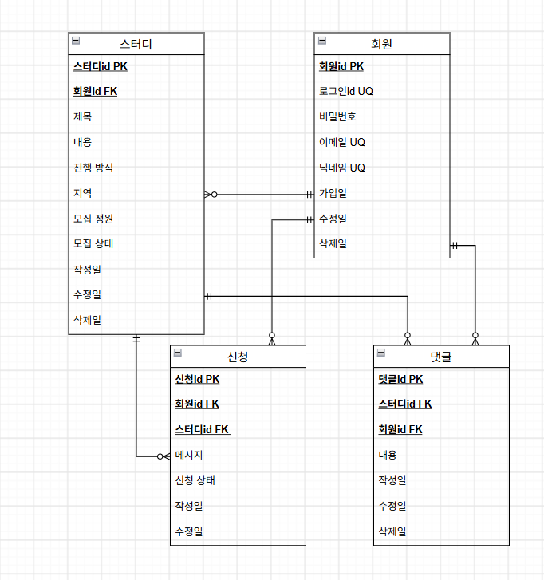
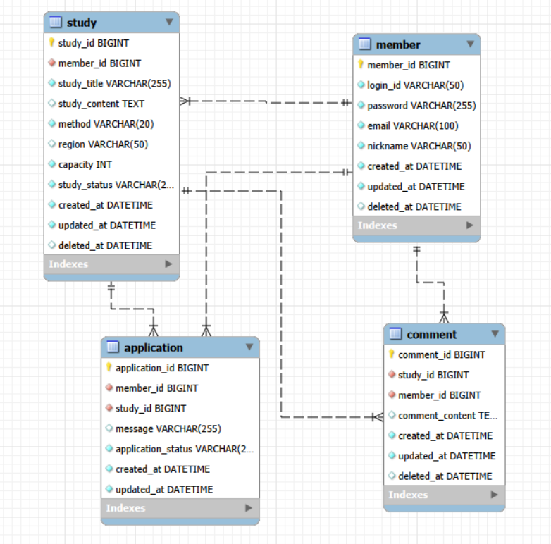

# Study Community Platform

스터디 모집 및 커뮤니티 기능을 제공하는 웹 플랫폼 프로젝트입니다.  
사용자는 스터디를 개설하고, 다른 사용자의 스터디에 신청할 수 있으며  
커뮤니티 게시판을 통해 자유롭게 소통할 수 있습니다.

본 프로젝트는 **데이터 모델링 중심으로 설계된 웹 서비스 프로젝트**로  
요구사항 분석부터 ERD 설계, 데이터베이스 스키마 정의까지의 과정을 포함합니다.

---

# 📌 프로젝트 목적

- 스터디 모집 및 관리 플랫폼 구현
- 사용자 간 커뮤니티 기능 제공
- 데이터 모델링 기반 서비스 설계 경험
- GitHub 기반 프로젝트 관리

---

# 🚀 주요 기능

## 1. 회원 기능
- 회원 가입
- 로그인 / 로그아웃
- 회원 정보 수정
- 회원 탈퇴

## 2. 스터디 모집 기능
- 스터디 모집 글 작성
- 스터디 모집 글 조회
- 스터디 모집 글 수정
- 스터디 모집 글 삭제
- 모집 상태 관리

## 3. 스터디 신청 기능
- 스터디 신청
- 신청 취소
- 신청 승인 / 거절
- 신청 상태 관리
- 스터디 신청자 목록 조회

## 4. 커뮤니티 기능
- 게시글 작성 / 조회 / 수정 / 삭제
- 댓글 작성 / 수정 / 삭제

---

# 🧩 주요 비즈니스 규칙

- 회원은 여러 개의 스터디를 개설할 수 있다.
- 회원은 여러 스터디에 신청할 수 있다.
- 동일 회원은 동일 스터디에 **중복 신청할 수 없다.**
- 스터디 모집 상태가 `CLOSED`인 경우 신청할 수 없다.
- 스터디 신청 상태는 다음과 같이 관리된다.
  - PENDING → 승인 대기
  - APPROVED → 승인
  - REJECTED → 거절
  - CANCELED → 신청 취소

- 스터디 정원을 초과하여 승인할 수 없다.

---

# 🗄 데이터 모델링

본 프로젝트는 다음 단계로 데이터 모델링을 진행하였다.

1. 요구사항 분석
2. 개념적 모델링
3. 논리적 모델링
4. 물리적 모델링

---

# 📊 ERD

- 개념적 모델링



- 논리적 모델링



- 물리적 모델링


---

# 🗂 데이터베이스 구조

## 주요 테이블

| 테이블 | 설명 |
|------|------|
| member | 회원 정보 |
| study | 스터디 모집 |
| application | 스터디 신청 |
| post | 커뮤니티 게시글 |
| comment | 게시글 댓글 |

---

## 📁 프로젝트 구조
``` 
study-community-platform
│
├─ docs
│ ├─ 01-requirements.md # 요구사항 분석
│ ├─ 02-conceptual-model.md # 개념적 모델링
│ ├─ 03-logical-model.md # 논리적 모델링
│ ├─ 04-physical-model.md # 물리적 모델링
│ └─ erd
│ ├─ ERD_v1.png # 초기 ERD
│ ├─ ERD_v2.png # 논리 모델 기반 ERD
│ └─ ERD_v3.png # 최종 ERD
│
├─ database
│ └─ ddl.sql # 데이터베이스 테이블 생성 SQL
│
└─ README.md # 프로젝트 소개 문서
``` 
---

# 🧱 데이터베이스 스키마

데이터베이스 생성 SQL은 아래 파일에서 확인할 수 있습니다.

- [DDL Script](database/ddl.sql)


주요 특징

- PK : BIGINT AUTO_INCREMENT
- FK 관계 명확히 정의
- Soft Delete (`deleted_at`)
- 중복 신청 방지 UNIQUE 제약
- 검색 성능을 위한 인덱스 설계

---

# ⚙ 기술 스택

| 구분 | 기술 |
|-----|------|
| Version Control | Git / GitHub |
| Database | MySQL |
| Modeling | ERD 설계 |
| Language | SQL |

(추후 Backend / Frontend 기술 추가 예정)

---

## 📚 프로젝트 설계 문서

프로젝트 설계 문서는 아래에서 확인할 수 있습니다.

- [요구사항 분석](docs/01-requirements.md)
- [개념적 모델링](docs/02-conceptual-model.md)
- [논리적 모델링](docs/03-logical-model.md)
- [물리적 모델링](docs/04-physical-model.md)

---

# 🔮 향후 개발 계획

- Backend API 구현
- 사용자 인증 기능
- 스터디 관리 기능
- 커뮤니티 게시판 기능
- 댓글 기능
- REST API 설계
- 테스트 코드 작성

---


## 👨‍💻 Author

- GitHub: [ldhan](https://github.com/ldhan0115)