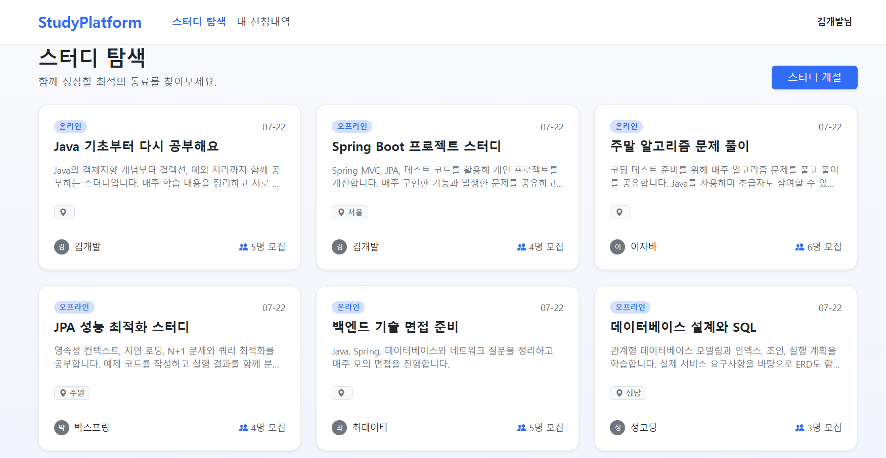
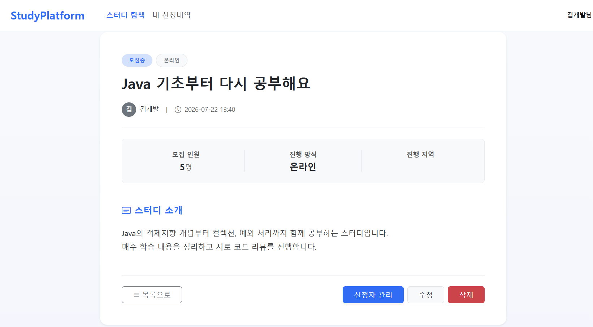
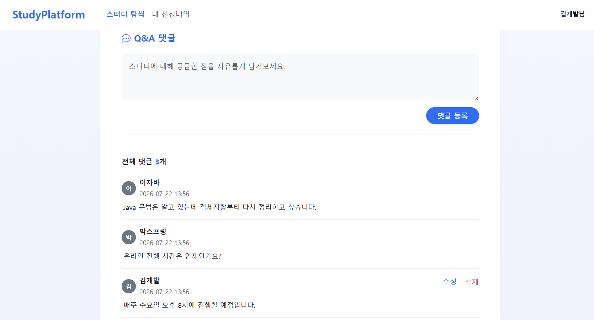
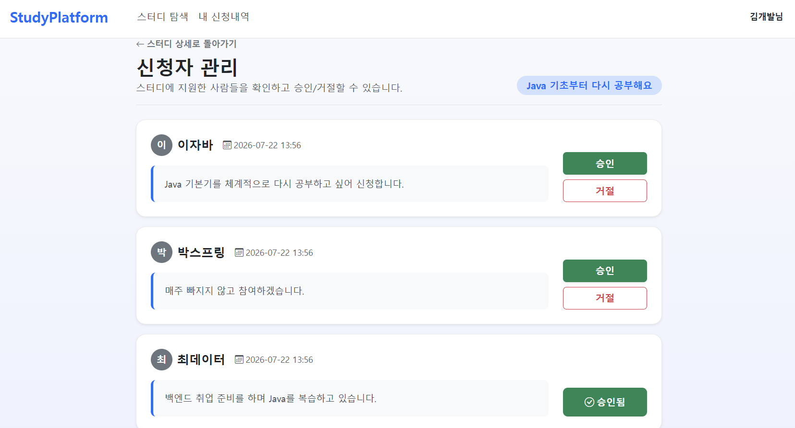
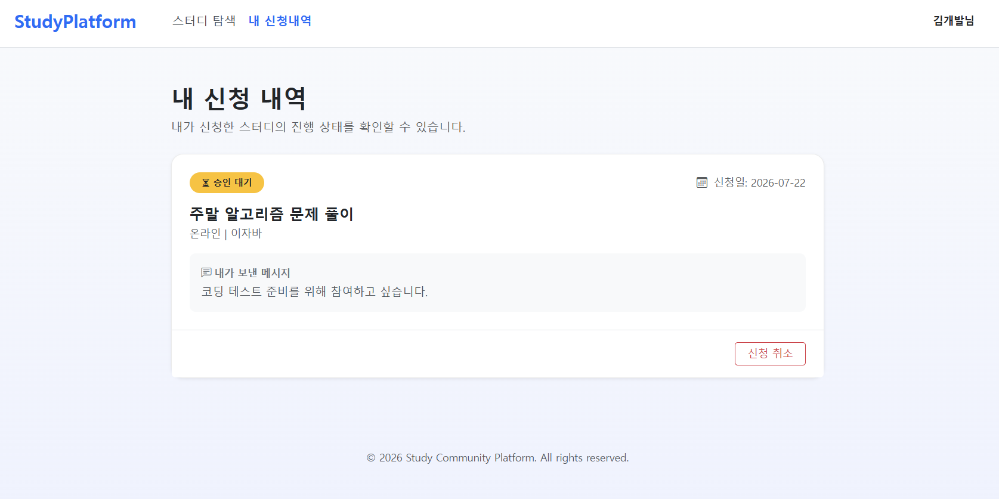

# 📚 Study Community Platform

> 스터디 모집부터 참가 신청, 승인·거절, 댓글 관리까지 제공하는 Spring MVC 기반 커뮤니티 웹 애플리케이션

회원은 스터디를 개설하거나 참가를 신청할 수 있으며, 스터디 방장은 신청자를 승인하거나 거절할 수 있습니다. 승인 인원이 정원에 도달하면 모집이 자동으로 마감됩니다.

**Spring Security 기반 세션 인증**, **서비스 계층의 권한 검증**, **입력 검증과 상태 전이**, **논리적 삭제**, **MySQL·Flyway 스키마 관리**를 중심으로 프로젝트를 개선하고 있습니다.

| 구분 | 내용 |
| --- | --- |
| 개발 기간 | 2026.02.13 ~ 진행 중 |
| 개발 인원 | 1명 |
| 개발 형태 | 개인 프로젝트 |
| 주요 관심사 | 인증·인가, 도메인 규칙, 데이터 정합성, JPA, 테스트 |

## ⭐ 핵심 구현

### 1. Spring Security 인증과 세션 관리

- 로그인 POST 요청은 Spring Security 인증 필터가 처리합니다.
- `CustomUserDetailsService`에서 활성 회원을 조회하고 `PasswordEncoder`로 비밀번호를 검증합니다.
- 인증은 `SecurityContext`에서 관리하며, 화면용 세션 속성에는 `LoginMemberSession(id, nickname)`을 저장합니다.
- 화면용 DTO에는 비밀번호와 이메일을 포함하지 않습니다.
- CSRF 검증과 로그인 성공 시 세션 ID 변경을 적용했습니다.
- 회원정보 수정에 성공하면 현재 세션과 인증 정보를 정리하고 변경한 정보로 다시 로그인하도록 합니다.
- 수정 실패 시 기존 DB 정보와 인증 상태를 유지합니다.
- 탈퇴 회원의 기존 로그인 세션도 다음 요청에서 `ActiveMemberFilter`가 정리합니다.

### 2. 서비스 계층의 권한 검증

- 스터디 수정·삭제는 실제 작성자만 수행할 수 있습니다.
- 신청 승인·거절은 신청에 연결된 실제 스터디의 방장만 수행할 수 있습니다.
- 신청 취소는 신청자 본인만 수행할 수 있습니다.
- 댓글 수정·삭제는 작성자 본인만 수행할 수 있으며, URL의 스터디 ID와 댓글의 실제 소속도 확인합니다.
- 데이터 변경 시 `ActiveMemberService`에서 요청 회원의 활성 상태를 확인합니다.

### 3. 서버 측 입력 검증과 오류 안내

- 회원·스터디·신청·댓글 입력 폼에 Bean Validation을 적용했습니다.
- 스터디·신청·댓글의 도메인 메서드에서도 입력 규칙을 검사합니다.
- 회원 이메일은 도메인에서도 필수 여부와 최대 길이를 검사합니다.
- 회원 정보의 사전 중복 검사와 DB UNIQUE 제약 충돌을 처리해 폼에 오류를 안내합니다.
- 댓글·신청 메시지 검증 실패 시 Flash 속성으로 오류와 입력값을 전달합니다.
- 댓글 수정 오류의 입력값은 해당 댓글의 수정 버튼을 다시 누르면 확인할 수 있습니다.

### 4. 참가 신청과 모집 정원 정책

- 새 신청은 `PENDING`이며, 대기 상태에서만 승인·거절·취소할 수 있습니다.
- `PENDING` 또는 `APPROVED` 신청이 있으면 같은 스터디에 추가 신청할 수 없습니다.
- 취소·거절 후에는 기존 이력을 보존하고 새로운 신청을 생성합니다.
- 방장은 자신의 스터디에 신청할 수 없습니다.
- 승인 인원을 기준으로 정원을 검사하고, 정원에 도달하면 `CLOSED`로 전환합니다.
- 승인 인원보다 작은 정원으로 수정할 수 없습니다.
- 정원을 늘려 여유가 생기면 `OPEN`으로 다시 전환합니다.

현재 중복 신청·정원 검사는 순차 요청을 기준으로 구현되어 있으며, 동시 요청 제어는 추가 개선 대상입니다.

### 5. 논리적 삭제와 삭제 이후 접근 제어

- 회원·스터디·댓글은 `deletedAt`을 기록해 삭제 이력을 보존합니다.
- 탈퇴한 계정의 로그인 ID·이메일·닉네임은 재사용하지 않습니다.
- 스터디와 댓글은 `@SQLRestriction`으로 삭제된 행을 일반 엔티티 조회에서 제외합니다.
- 신청 단건 조회와 내 신청 목록에서는 부모 스터디의 삭제 여부를 확인합니다.
- 댓글 변경 시 댓글과 부모 스터디의 활성 상태를 확인합니다.
- 탈퇴 회원이 작성한 기존 댓글의 작성자 연관관계는 보존합니다.

### 6. MySQL 환경 분리와 Flyway

- Docker Compose로 개발용 MySQL과 테스트용 MySQL을 분리했습니다.
- MySQL 스키마는 Flyway 마이그레이션으로 생성하고 Hibernate는 `ddl-auto: validate`로 매핑을 검증합니다.
- 기본 테스트는 인메모리 H2, MySQL 통합 테스트는 별도 `mysqlTest` 작업으로 실행합니다.
- `Study.content`에 `@Lob`과 `@Column(length = Length.LONG32)`를 적용해 MySQL `LONGTEXT`와 매핑을 맞췄습니다.
- 샘플 데이터는 `local` 프로필에서 생성 옵션을 켜고 회원 테이블이 비어 있을 때만 생성합니다.

## 🖥 주요 화면

### 스터디 목록

진행 방식, 지역, 모집 상태와 정원을 확인할 수 있습니다.



### 스터디 상세 및 참가 신청

스터디 소개와 모집 상태를 확인하고 참가를 신청합니다.



### 댓글 작성 및 관리

로그인 회원은 댓글을 작성하고, 작성자 본인은 자신의 댓글을 수정·삭제할 수 있습니다.



### 참가 신청 관리

방장은 대기 중인 신청을 승인하거나 거절할 수 있습니다.



### 내 신청 내역

자신의 신청 상태를 확인하고 대기 중인 신청을 취소할 수 있습니다.



## 🔐 인증·인가 및 오류 처리

| 영역 | 처리 방식 |
| --- | --- |
| 공개 요청 | 홈, 회원가입·로그인 화면, 스터디 목록·숫자 ID 상세 조회, 회원가입·로그인 POST |
| 보호 요청 | 회원정보 수정·탈퇴, 스터디 개설·수정·삭제, 신청 관리, 내 신청 내역, 댓글 변경 |
| URL 접근 제어 | `SecurityFilterChain` |
| 로그인 회원 전달 | `@Login`, `LoginMemberArgumentResolver` |
| 로그인 후 이동 | 저장된 보호 페이지 요청으로 복귀, 없으면 홈으로 이동 |
| 로그아웃 | `POST /members/logout`, 세션·인증 정보 정리 및 세션 쿠키 삭제 |
| 회원정보 수정 성공 | 현재 세션 정리 후 `/members/login?updated`로 이동 |
| 탈퇴 후 기존 세션 | 다음 요청에서 활성 회원 검사 후 인증 정리 |
| 비밀번호 | 가입·수정 시 단방향 해시, 인증 시 해시와 입력값 비교 |

회원가입·로그인을 포함한 상태 변경 요청에도 CSRF 검증을 적용합니다. 정적 파일과 오류 경로는 별도로 공개합니다. 회원정보 수정 후 재로그인 정책은 현재 요청의 세션에 적용합니다.

| 예외 | 전역 처리 시 HTTP 상태 |
| --- | --- |
| `ResourceNotFoundException` | 404 |
| `ForbiddenOperationException` | 403 |
| `BusinessRuleException` | 400 |

`GlobalExceptionHandler`는 실제 HTTP 상태와 공통 오류 화면을 반환합니다. 폼 검증·회원 중복 오류와 참가 신청의 일부 비즈니스 오류는 컨트롤러에서 입력 화면 또는 Flash 메시지로 안내합니다.

## 🧩 입력 및 상태 규칙

아래 길이는 애플리케이션 입력 규칙입니다. DB의 자료형·NULL 허용 여부는 [물리 모델](./docs/04-physical-model.md)에 별도로 정리했습니다.

| 입력 항목 | 규칙 |
| --- | --- |
| 로그인 ID | 빈 값·공백만 입력 불가, 4~20자 |
| 비밀번호 | 빈 값·공백만 입력 불가, 8~20자 |
| 이메일 | 필수, 이메일 형식, 최대 100자 |
| 닉네임 | 빈 값·공백만 입력 불가, 2~20자 |
| 스터디 제목 | 빈 값·공백만 입력 불가, 최대 255자 |
| 스터디 본문 | 빈 값·공백만 입력 불가, 최대 10,000자 |
| 진행 방식·지역 | 진행 방식 필수, 지역 최대 50자, 오프라인은 지역 필수, 온라인은 NULL 저장 |
| 모집 정원 | 1명 이상, 수정 시 현재 승인 인원 이상 |
| 신청 메시지 | 빈 값·공백만 입력 불가, 최대 255자 |
| 댓글 | 빈 값·공백만 입력 불가, 최대 1,000자 |

| 현재 신청 상태 | 허용되는 다음 상태 |
| --- | --- |
| `PENDING` | `APPROVED`, `REJECTED`, `CANCELED` |
| `APPROVED`, `REJECTED`, `CANCELED` | 변경 불가 |

승인 인원은 해당 스터디의 `APPROVED` 신청 수로 계산합니다. 방장은 승인 인원에 포함하지 않습니다.

## 🛠 기술 스택

| 구분 | 기술 |
| --- | --- |
| Language | Java 21 |
| Framework | Spring Boot 4.0.3, Spring MVC |
| Security | Spring Security, HttpSession, PasswordEncoder |
| Data Access | Spring Data JPA, Hibernate |
| Database | MySQL 8.4, H2 |
| Schema Migration | Flyway |
| View | Thymeleaf, Bootstrap 5 |
| Validation | Jakarta Bean Validation |
| Test | JUnit Jupiter, AssertJ, MockMvc, Spring Security Test |
| Build | Gradle Wrapper 9.3.1 |
| Local Infrastructure | Docker Compose |
| Version Control | Git, GitHub |

## 🧪 테스트

정상 흐름과 함께 입력 오류, 권한 위반, 상태 변경 실패 후 데이터 유지 여부를 확인하는 테스트를 작성했습니다.

| 테스트 영역 | 주요 검증 내용 |
| --- | --- |
| 인증·HTTP 흐름 | 공개·보호 URL, 실제 로그인 세션의 요청, 세션 ID 변경, 로그아웃, CSRF 누락·변조 |
| 회원 | 중복 입력, DB UNIQUE 충돌의 오류 안내, 비밀번호 해시, 수정 성공 후 재로그인, 수정 실패 후 정보·인증 유지 |
| 입력 검증 | 회원·스터디·신청·댓글의 누락·공백·길이 경계, 잘못된 수정 후 기존 값 유지 |
| 권한·삭제 정책 | 타인 리소스 변경 차단, 탈퇴 회원의 기존 세션·서비스 호출 차단, 삭제된 스터디·댓글 접근 차단 |
| 모집 정책 | 방장 본인 신청 차단, 정원 미만·동일·초과 경계, 정원 증가 후 재모집 |
| 신청 상태 | 허용·금지 전이, 중복 신청 차단, 취소·거절 후 재신청 |
| MySQL | Flyway 적용·재실행, 스키마 검증, 한글·이모지·Enum 저장, UNIQUE·FK 제약 |

### 기본 테스트: 인메모리 H2

```powershell
.\gradlew.bat clean test
```

### MySQL 통합 테스트

```powershell
docker compose --profile test up -d --wait mysql-test
.\gradlew.bat mysqlTest
```

### 두 테스트 작업 함께 실행

```powershell
docker compose --profile test up -d --wait mysql-test
.\gradlew.bat clean test mysqlTest
```

macOS·Linux에서는 `.\gradlew.bat` 대신 `./gradlew`를 사용합니다.

| 작업 | DB·프로필 | 결과 보고서 |
| --- | --- | --- |
| `test` | 인메모리 H2 · `test` | `build/reports/tests/test/index.html` |
| `mysqlTest` | `study_platform_test` · `mysql-test` | `build/reports/tests/mysqlTest/index.html` |

`MySqlPersistenceTest`는 테스트 전후에 전용 DB의 애플리케이션 데이터를 정리하며 Flyway 이력은 유지합니다. 테스트 클래스 전체를 트랜잭션으로 감싸지 않고 서비스 처리 후 커밋된 데이터를 조회합니다.

## ▶️ 로컬 실행

### 요구 환경

- Java 21
- 실행 중인 Docker Desktop 또는 Docker Engine과 Compose
- Gradle 의존성과 Docker 이미지를 다운로드할 수 있는 네트워크

### 저장소 복제

```bash
git clone https://github.com/ldhan0115/study-community-platform.git
cd study-community-platform
```

이후 명령은 `build.gradle`과 `compose.yml`이 있는 프로젝트 최상위 폴더에서 실행합니다.

### 개발용 MySQL 및 애플리케이션 실행

```powershell
docker compose up -d --wait mysql
.\gradlew.bat bootRun --args="--spring.profiles.active=local"
```

실행 후 [http://localhost:8080](http://localhost:8080)에 접속합니다.

| 용도 | Compose 서비스 | 호스트 포트 | DB |
| --- | --- | --- | --- |
| 개발·화면 확인 | `mysql` | 3307 | `study_platform` |
| MySQL 통합 테스트 | `mysql-test` | 3308 | `study_platform_test` |

개발용 계정은 `study / study_local_password`이며, 전체 JDBC 설정은 `application-local.yml`에서 확인할 수 있습니다. Compose의 계정·비밀번호는 로컬 개발용 예시입니다.

### 샘플 데이터 생성

빈 개발 DB에 샘플이 필요하면 애플리케이션을 다음 옵션으로 실행합니다.

```powershell
.\gradlew.bat bootRun --args="--spring.profiles.active=local --app.seed.enabled=true"
```

`TestDataInit`은 `local` 프로필, 생성 옵션 활성화, 회원 테이블이 비어 있는 조건에서 회원 6명·스터디 7개·댓글 8개·신청 9개를 생성합니다. 일반 실행 시 생성 옵션의 기본값은 `false`입니다.

| 확인할 화면 | 로그인 ID | 비밀번호 |
| --- | --- | --- |
| 방장 신청자 관리 | `test1` | `test1234` |
| 참가 신청·내 신청 내역 | `test2` | `test1234` |

생성된 데이터는 MySQL 볼륨에 저장됩니다. 이후 일반 실행에서도 유지되며, `docker compose down -v`로 볼륨을 삭제하면 데이터도 삭제됩니다.

## 🗄 실행 환경과 스키마 관리

| 환경 | 설정 파일 | DB | Hibernate | Flyway |
| --- | --- | --- | --- | --- |
| 공통 | `application.yml` | 환경별 설정 | `validate` | 활성 |
| 로컬 | `application-local.yml` | Compose MySQL | `validate` | 활성 |
| 운영용 설정 | `application-prod.yml` | 환경변수로 지정한 MySQL | `validate` | 활성 |
| 기본 테스트 | `application-test.yml` | 인메모리 H2 | `create-drop` | 비활성 |
| MySQL 테스트 | `application-mysql-test.yml` | 전용 MySQL | `validate` | 활성 |

- 기본 프로필은 `local`입니다.
- 운영용 설정은 `DB_URL`, `DB_USERNAME`, `DB_PASSWORD` 환경변수를 사용합니다. 실제 클라우드 배포는 향후 과제입니다.
- MySQL 실행 DDL은 `src/main/resources/db/migration/mysql/V1__initial_schema.sql`에서 관리합니다.
- V1은 빈 MySQL 스키마용이며, 기존 H2 데이터의 이전 작업은 포함하지 않습니다.
- 적용된 마이그레이션은 유지하고 후속 변경은 새로운 버전의 SQL로 추가합니다.
- `database/ddl.sql`은 실행용 마이그레이션 위치를 안내합니다.
- SQL 파라미터 바인딩 로그는 비활성화했습니다.

## 🔥 트러블슈팅

| 문제 | 개선 내용 |
| --- | --- |
| [비밀번호 평문 저장](./docs/troubleshooting/password-encoding.md) | PasswordEncoder로 가입·수정 시 해시 처리 |
| [회원 수정 후 세션 ID 유실](./docs/troubleshooting/member-session-id-loss.md) | 엔티티와 화면용 세션 DTO 분리 |
| [비로그인 사용자 NPE](./docs/troubleshooting/npe-guest-access.md) | 비로그인 상태를 명시적으로 처리 |
| [스터디 권한 우회](./docs/troubleshooting/study-authorization-bypass.md) | 서비스에서 실제 작성자 검증 |
| [신청 권한 우회](./docs/troubleshooting/prevent-api-authorization-bypass.md) | 실제 신청·스터디 연관관계로 권한 검증 |
| [신청 상태 재변경](./docs/troubleshooting/application-state-transition.md) | PENDING에서만 상태 변경 허용 |
| [탈퇴 회원 재로그인](./docs/troubleshooting/withdrawn-member-login.md) | 로그인 대상에 활성 회원 조건 적용 |
| [취소 후 재신청](./docs/troubleshooting/reapply-after-cancel-bug.md) | PENDING·APPROVED만 유효 중복으로 판단 |
| [본인 정보 중복 판정](./docs/troubleshooting/self-data-validation-bug.md) | 변경된 항목만 중복 검사 |
| [샘플 초기화 시점](./docs/troubleshooting/test-data-init-failed.md) | 애플리케이션 준비 이벤트와 트랜잭션 적용 |
| [생성일 누락](./docs/troubleshooting/member-created-at-null.md) | JPA 생명주기 콜백으로 시간 관리 |

트러블슈팅 문서는 각 문제를 해결한 당시의 기록입니다. 현재 회원정보 수정 성공 정책은 현재 세션을 정리하고 재로그인하는 방식입니다.

MySQL 전환 중에는 `study_content`의 실제 타입 `LONGTEXT`와 Hibernate가 기대한 `TINYTEXT`가 달라 초기화가 실패했습니다. `Study.content`의 LOB 길이를 `Length.LONG32`로 명시해 매핑을 맞췄습니다.

## 📂 주요 구조와 설계 문서

Java 패키지 기준 경로: `src/main/java/com/study/study_community_platform`

| 경로 | 역할 |
| --- | --- |
| `config`, `config/security` | 인증·인가, 활성 회원 필터, 비밀번호·MVC 설정 |
| `controller`, `controller/advice` | 웹 요청과 전역 예외 처리 |
| `controller/web` | 입력 폼, @Login, 화면용 세션 DTO |
| `domain` | 엔티티, 상태 전이와 입력 규칙 |
| `exception` | 리소스·권한·비즈니스·중복 입력 예외 |
| `repository` | JPA 조회 |
| `service`, `service/dto` | 트랜잭션, 활성 회원·권한·정원 검사 |
| `TestDataInit.java` | 선택적으로 실행하는 로컬 샘플 초기화 |
| `src/main/resources/db/migration/mysql` | MySQL Flyway 마이그레이션 |
| `src/test/java` | 도메인·서비스·HTTP·MySQL 테스트 |

- [요구사항](./docs/01-requirements.md)
- [개념적 데이터 모델](./docs/02-conceptual-model.md)
- [논리적 데이터 모델과 관계 ERD](./docs/03-logical-model.md)
- [물리적 데이터 모델](./docs/04-physical-model.md)
- [실행 DDL](./src/main/resources/db/migration/mysql/V1__initial_schema.sql)

## 📌 향후 개선

- 동시 승인·중복 신청·상태 변경 충돌 재현 및 동시성 제어
- 실제 SQL·실행 계획을 통한 조회 성능과 인덱스 검증
- 목록 페이지네이션과 검색 조건
- GitHub Actions에서 H2·MySQL 테스트 자동화
- 애플리케이션 Docker 이미지와 클라우드 배포
- 트러블슈팅 문서 및 화면 자료 갱신