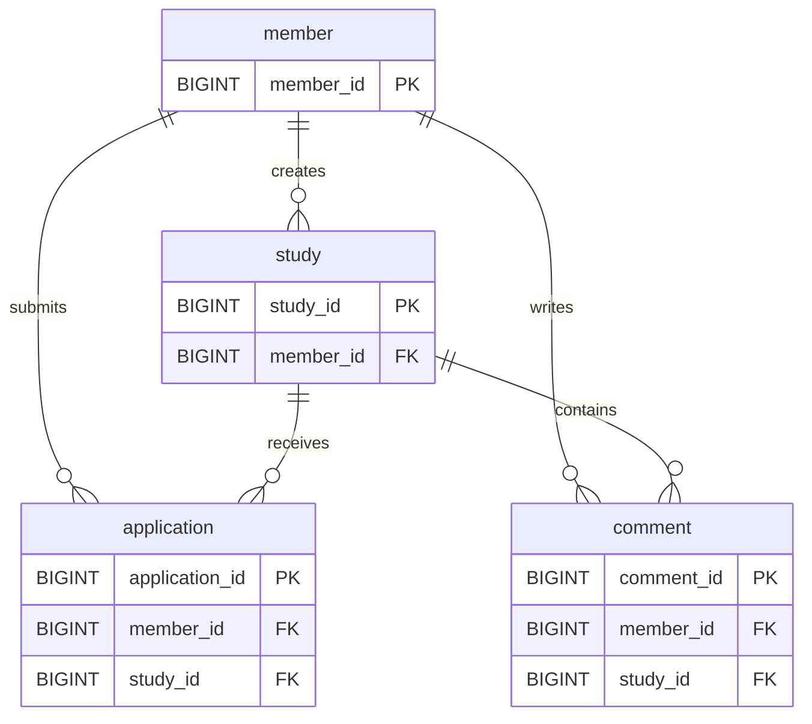

# 논리적 모델링 (Logical Data Modeling)

회원, 스터디, 참가 신청, 댓글의 식별자와 관계, 도메인 규칙을 정의한다.

표의 자료형과 DB 제약은 현재 MySQL Flyway V1 스키마에 맞춰 표기한다. 엔진·인덱스·환경 설정은 [물리적 모델](./04-physical-model.md)에서 다룬다.

`NULL 허용`은 DB 스키마 기준이다. 애플리케이션에서 필수 입력으로 검증하는 항목과 구분한다.

## 1. Member

회원의 로그인 정보와 프로필, 탈퇴 이력을 저장한다.

| 컬럼 | 타입 | DB 제약 | 설명 |
| --- | --- | --- | --- |
| member_id | BIGINT | PK, NOT NULL | 회원 식별자 |
| login_id | VARCHAR(50) | NOT NULL, UNIQUE | 로그인 ID |
| password | VARCHAR(255) | NOT NULL | 단방향 해시된 비밀번호 |
| email | VARCHAR(100) | NOT NULL, UNIQUE | 이메일 |
| nickname | VARCHAR(50) | NOT NULL, UNIQUE | 표시 이름 |
| created_at | DATETIME(6) | NOT NULL | 생성일 |
| updated_at | DATETIME(6) | NOT NULL | 수정일 |
| deleted_at | DATETIME(6) | NULL 허용 | 탈퇴일 |

- 활성 회원 조회와 로그인에는 `deleted_at IS NULL` 조건을 사용한다.
- 탈퇴한 회원의 로그인 ID·이메일·닉네임도 중복 검사에 포함해 재사용을 막는다.
- 탈퇴 후에도 작성한 스터디·댓글·신청과의 연관관계는 유지한다.
- 세션의 화면용 데이터는 엔티티 대신 `LoginMemberSession`으로 전달한다.

## 2. Study

회원이 개설한 스터디의 소개, 진행 방식, 정원과 모집 상태를 저장한다.

| 컬럼 | 타입 | DB 제약 | 설명 |
| --- | --- | --- | --- |
| study_id | BIGINT | PK, NOT NULL | 스터디 식별자 |
| member_id | BIGINT | FK, NOT NULL | 작성자 |
| study_title | VARCHAR(255) | NOT NULL | 제목 |
| study_content | LONGTEXT | NULL 허용 | 본문 |
| method | ENUM | NOT NULL | ONLINE, OFFLINE |
| region | VARCHAR(50) | NULL 허용 | 오프라인 지역 |
| capacity | INT | NOT NULL | 승인 가능한 신청자 정원 |
| study_status | ENUM | NOT NULL | OPEN, CLOSED |
| created_at | DATETIME(6) | NOT NULL | 생성일 |
| updated_at | DATETIME(6) | NOT NULL | 수정일 |
| deleted_at | DATETIME(6) | NULL 허용 | 삭제일 |

- 작성자만 수정·삭제할 수 있다.
- 제목과 본문은 필수이며 공백만 입력할 수 없다. 최대 길이는 제목 255자, 본문 10,000자다.
- OFFLINE은 지역이 필수이며, ONLINE은 지역을 NULL로 저장한다.
- 정원은 1명 이상이고, 승인된 신청 수보다 작게 수정할 수 없다.
- 방장은 자신의 스터디에 신청할 수 없으며 승인 인원에 포함하지 않는다.
- 승인 인원과 정원이 같으면 CLOSED, 정원 수정 후 여유가 생기면 OPEN으로 전환한다.

## 3. Application

회원의 참가 신청과 처리 이력을 저장한다.

| 컬럼 | 타입 | DB 제약 | 설명 |
| --- | --- | --- | --- |
| application_id | BIGINT | PK, NOT NULL | 신청 식별자 |
| member_id | BIGINT | FK, NOT NULL | 신청자 |
| study_id | BIGINT | FK, NOT NULL | 신청 대상 |
| message | VARCHAR(255) | NULL 허용 | 신청 메시지 |
| application_status | ENUM | NOT NULL | PENDING, APPROVED, REJECTED, CANCELED |
| created_at | DATETIME(6) | NOT NULL | 신청일 |
| updated_at | DATETIME(6) | NOT NULL | 수정일 |

- 생성 시 상태는 PENDING이다.
- 신청 메시지는 애플리케이션에서 필수 입력·공백만 입력 금지·최대 255자로 검증한다.
- 동일 회원·스터디에 PENDING 또는 APPROVED 신청이 있으면 추가 신청을 거부한다.
- 취소·거절 후에는 모집 중이고 유효한 신청이 없는 경우 새 신청을 생성한다.
- 재신청 이력을 보존하므로 `(member_id, study_id)` 전체에 UNIQUE 제약을 두지 않는다.
- 신청 취소는 행 삭제나 `deleted_at` 변경 대신 CANCELED 상태로 기록한다.
- 승인·거절은 실제 스터디 작성자, 취소는 실제 신청자만 수행한다.
- 부모 스터디가 삭제되면 신청 상태 변경과 내 신청 목록 조회 대상에서 제외한다.

## 4. Comment

스터디에 작성한 댓글과 삭제 이력을 저장한다.

| 컬럼 | 타입 | DB 제약 | 설명 |
| --- | --- | --- | --- |
| comment_id | BIGINT | PK, NOT NULL | 댓글 식별자 |
| study_id | BIGINT | FK, NOT NULL | 댓글이 속한 스터디 |
| member_id | BIGINT | FK, NOT NULL | 작성자 |
| content | LONGTEXT | NULL 허용 | 댓글 내용 |
| created_at | DATETIME(6) | NOT NULL | 생성일 |
| updated_at | DATETIME(6) | NOT NULL | 수정일 |
| deleted_at | DATETIME(6) | NULL 허용 | 삭제일 |

- 실제 내용 컬럼명은 `content`이다.
- 내용은 애플리케이션에서 필수 입력·공백만 입력 금지·최대 1,000자로 검증한다.
- 수정 검증에 실패하면 기존 내용을 유지한다.
- 작성자만 수정·삭제할 수 있고 URL의 스터디 ID와 댓글의 실제 소속을 확인한다.
- 댓글 또는 부모 스터디가 삭제된 경우 변경을 차단한다.
- 삭제된 댓글은 일반 엔티티 조회에서 제외한다.

## 5. 관계

각 자식 행은 하나의 부모 행을 참조한다. 부모는 자식을 0개 이상 가질 수 있다.

| 부모 | 자식 | 관계 | 외래키 |
| --- | --- | --- | --- |
| member | study | 1:N | study.member_id |
| member | application | 1:N | application.member_id |
| study | application | 1:N | application.study_id |
| member | comment | 1:N | comment.member_id |
| study | comment | 1:N | comment.study_id |

## 6. 상태 전이와 검증 책임

| 현재 신청 상태 | 다음 상태 | 처리 주체 |
| --- | --- | --- |
| PENDING | APPROVED | 스터디 작성자 |
| PENDING | REJECTED | 스터디 작성자 |
| PENDING | CANCELED | 신청자 |
| APPROVED, REJECTED, CANCELED | 변경 불가 | 최종 상태 |

`Application.approve()`, `reject()`, `cancel()`에서 상태 전이를 검사한다.

| 규칙 | 적용 위치 |
| --- | --- |
| PK·FK·회원 정보 중복 금지·NOT NULL | DB 제약 |
| 회원 입력 형식·길이 | 입력 폼, 이메일은 도메인에서도 검사 |
| 스터디·신청·댓글의 필수 입력·길이 | 입력 폼과 도메인 |
| 작업자의 활성 상태·소유자 권한 | 서비스, 인증 요청에는 활성 회원 필터도 적용 |
| 유효 상태 기준 중복 신청 | ApplicationService |
| 정원 및 모집 상태 | StudyService·ApplicationService·Study |
| 신청 상태 전이 | Application |

DB에서 NULL을 허용하는 `study_content`, `message`, `content`도 애플리케이션에서는 필수다. 현재 DDL에 이 세 컬럼의 NOT NULL 제약이나 정원 CHECK 제약은 없다.

중복 신청과 정원 규칙의 동시 요청 보장은 향후 동시성 제어로 보강한다.

## 7. 관계 ERD

식별자와 관계를 중심으로 표현한다. 전체 컬럼 정의는 위 표를 기준으로 한다.

## 8. 관련 문서

- [물리적 모델](./04-physical-model.md)
- [Flyway V1 DDL](../src/main/resources/db/migration/mysql/V1__initial_schema.sql)